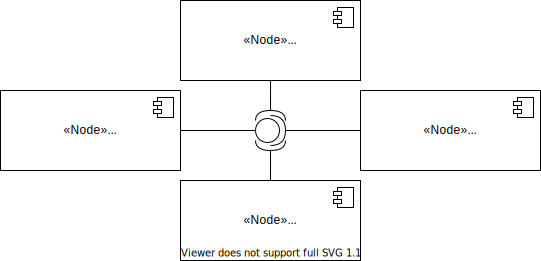

# Cyber-Physical Systems Software Architecture Docker Template
A minimal implementation of a cyber-physical systems (CPS) software architecture deployed in a [Docker][1] environment.

The template follows a queue-centric approach. The nodes **ChaosSensor** and **Dashboard** are loosely-couply via a meesage queue. 
The message queue broker **MQTTBroker** uses Eclipse's [Mosquitto][2] implementation. 
MQTT (Message Queuing Telemetry Transport) is used as a message transport protocol.
The following diagram illustrates the systems' components.



Data is published by the **ChaosSensor** node to the `chaossensor/1/data` topic. Data is collected and visualized by the **Dashboard** node. Therefore the **Dashboard** node subscribes to the `chaossensor/1/data` topic. 

**TickGen** distributed the simulation time tick to every node via the `tickgen/tick` topic.

## Software Requirements
Make sure that a hypervisor, such as [VirtualBox](https://www.virtualbox.org/), is installed and download the [CPS-VM-Appliance](https://users.informatik.haw-hamburg.de/~abp463/).

*OR*

Make sure that the following packages are installed on your system:
- docker
- bash

## Project Organization
In order to build, run, observe and stop the example system follow the steps in the following overview.
```
.
├── docs                - documents used in README.md
├── README.md           - this file
├── scripts
│   ├── build.sh        - builds custom images                      (step 1)
│   ├── observe.sh      - opens the dashboard URL                   (step 3a)
│   ├── run.sh          - creates containers                        (step 2)
│   ├── stop.sh         - stops containers                          (step 4)
│   └── subscribe.sh    - subscribes to all topics of mqttbroker    (step 3b)
└── src
    ├── chaos_sensor    - chaos_sensor implmentation 
    ├── dashboard       - dashboard implementation
    └── tick_gen        - TickGen implementation
```

## Node-RED Dashboard
[Node-RED][3] is a flow-based programming tool for wiring together hardware devices, APIs and online services as part of the IoT or CPS. It provides a visual browser-based flow editor. Node-RED is build on [Node.js][4]. The [node-red-dashboard][5] module is required for visualization functionality. It offers a huge set of common building blocks, but also allows to write custom JavaScript routines.

Important URLs:
- Editor:  [http://127.0.0.1:1880/](http://127.0.0.1:1880/)
- Dashboard: [http://127.0.0.1:1880/ui](http://127.0.0.1:1880/ui)

In this project, Node-RED runs in the mode [Dockerfile which copies in local resources][6]. Thus changes to _flows_ have to be save and copied manually. This can be achieved via the `Editor > Export` or `docker cp dashboard:/data/flows.json <PATH_TO_DASHBOARD_FOLDER>`. If at least one configuration file is updated the dashboard docker image needs to be updated (resume to step 1).

[1]: https://www.docker.com/
[2]: https://hub.docker.com/_/eclipse-mosquitto/
[3]: https://nodered.org/
[4]: https://nodejs.org/en/
[5]: https://github.com/node-red/node-red-dashboard
[6]: https://nodered.org/docs/getting-started/docker#dockerfile-which-copies-in-local-resources

